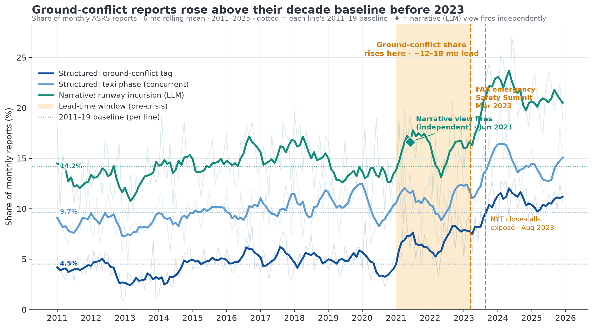
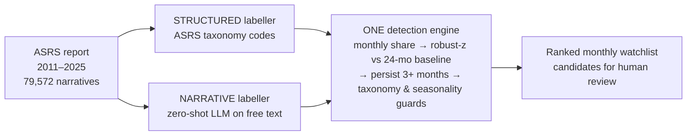

# Early warning from near-misses — IATA Senior Data Scientist case study

**Can publicly available data surface emerging aviation-safety risks *before* they are widely recognised?** This study shows it can, on a worked example, using 15 years of NASA Aviation Safety Reporting System (ASRS) data.

> **Headline finding.** Surface / runway "ground-conflict" near-misses began rising in **2021–2022 — roughly 12–18 months before** the public inflection (the FAA's March 2023 emergency Safety Summit and the August 2023 *New York Times* close-calls exposé). Two independent views agreed in direction and timing: the **structured** ground-conflict share roughly doubled, while a **zero-shot language model** reading the free-text narratives **fired** on runway incursions in **June 2021**.



---

## Deliverables

| | File | What |
|---|---|---|
| 📄 **Report** | [`writing/P07_early-warning-report.pdf`](writing/P07_early-warning-report.pdf) | The standalone written analysis (framing → method → finding → robustness → validation → decision-support). **Start here.** |
| 📊 **Slides** | [`writing/P07_deck.pdf`](writing/P07_deck.pdf) | 6-slide presentation (+ appendix) for the interview. |
| 📓 **Notebooks** | [`production/build/`](production/build/) | Executed, supporting code (EDA, structured signals, narrative signals). |
| 📐 **Method spec** | [`production/spec/P03_methodology.md`](production/spec/P03_methodology.md) | Exact definitions — metric, detector, thresholds, bias guards. |

---

## The approach in one diagram



Track each risk category's **share** of the month's reports (not raw counts, to control for reporting-volume swings); fire on a **robust z ≥ 2** anomaly that **persists ≥ 3 months**, after taxonomy-change and seasonality guards. The two views differ only in *how a report is labelled* — agreement between them is the credibility core.

---

## Repository map

```
case-study.md                    The brief (task as given)
README.md                        This file
requirements.txt                 Python dependencies

writing/
  P07_early-warning-report.pdf/.md   ► PRIMARY report (+ P07_report.css)
  P07_deck.pdf / P07_deck.md             ► Slides (Marp source + render)
  assets/                        Figures used by report & deck

production/
  build/                         Notebooks + scripts (run from here)
    P02_01-eda.ipynb                 EDA / data QA
    P04_02-structured-signals.ipynb  Signal A (structured taxonomy trends)
    P04_03-narrative-signals.ipynb   Signal B (zero-shot LLM + topic discovery)
    P01_build_dataset.py             Raw CSV → processed parquet
    P07_make_*.py                    Chart builders
    P04_validate_narrative_labels.py Narrative-classifier precision spot-check
  spec/P03_methodology.md            ► Method spec (single source of truth)
  output/                        Figures, signal tables, derived parquets

research/notes/                  Data source, corroboration, validation, cost
provenance-ledger.md             Full change log (author · timestamp · change)
data/                            NOT committed — fetch per "Reproduction" below
```

**Filename convention.** Every generated artifact is prefixed `P0N_` with the roadmap phase that produced it (`P00` framing · `P01` data · `P02` EDA · `P03` method · `P04` signals · `P05` corroboration · `P07` report/deck), so any file traces back to a step in the analysis. Fixed inputs (`case-study.md`), root meta files (this README, `provenance-ledger.md`), and gitignored `data/` are exempt.

Working/process files (`plans/`, `provenance-ledger.md`) are kept deliberately — see **Authorship & provenance** below.

---

## Key numbers

- **Data:** 80,047 ASRS reports (2011–2025, US), 127 fields; 79,572 with free-text narrative.
- **Structured ground-conflict share:** 4.1% (2011) → 6.7% (2021) → 9.0% (2023) → **11.2% (2024)** → 10.5% (2025); raw count roughly tripled while total reporting stayed flat.
- **Narrative detector:** full run over 79,572 narratives via OpenRouter `deepseek/deepseek-v4-flash`; runway-incursion label fires **June 2021**.
- **Lead time:** ~12–18 months ahead of the FAA summit (Mar 2023) / NYT exposé (Aug 2023).
- **Robustness:** incursion *rate* ran ~15% above pre-pandemic; serious (Cat A&B) incursions hit a 6-year high of 22 in FY2023 — rules out the "just more traffic" objection.
- **Narrative validation:** reviewer spot-check of 30 flagged narratives → 70% broad / 37% strict precision; 88% (7/8) at confidence ≥0.95 (small bands). Trend is used, not absolute level.

---

## Reproduction

### 1. Environment
```bash
python3.12 -m venv .venv && source .venv/bin/activate
pip install -r requirements.txt
```

### 2. Get the data (not committed)
The ASRS data is NASA's public extract and is not redistributed here.

1. Go to the ASRS Database Online (DBOL): https://asrs.arc.nasa.gov/search/database.html
2. Filter on **Date of Incident** only (all categories); export **CSV**. The export is capped at 10,000 records, so pull in ≤1-year chunks.
3. Save chunks as `data/raw/asrs_<YYYY>.csv` (2011–2025).
4. Build the processed dataset:
   ```bash
   python production/build/P01_build_dataset.py   # → data/processed/asrs.parquet (80,047 reports)
   ```

Full export recipe (fields, schema, chunking, verified method) is in [`research/notes/P01_asrs-data-source.md`](research/notes/P01_asrs-data-source.md). NASA was changing the DB structure as of mid-2026, so pin your export date.

### 3. Run the analysis
Run the notebooks in order from the repo root (they resolve paths automatically):
```
production/build/P02_01-eda.ipynb          → production/output/eda/
production/build/P04_02-structured-signals.ipynb → production/output/signals/
production/build/P04_03-narrative-signals.ipynb  → production/output/narrative_signals/
```

**Signal B (narrative) needs an LLM key:**
```bash
export OPENROUTER_API_KEY=sk-...            # see .env.example
export OPENROUTER_MODEL=deepseek/deepseek-v4-flash   # default
```
The derived label parquets are **committed**, so you can inspect Signal B's results and re-run the downstream detector/charts **without** paying to re-run the LLM step.

### 4. Rebuild figures / documents (optional)
```bash
python production/build/P07_make_hero_chart.py        # and the other P07_make_*.py chart builders
# Slides:  marp writing/P07_deck.md --html --pdf --allow-local-files --no-stdin -o writing/P07_deck.pdf
#          (--allow-local-files embeds the figures; --no-stdin stops Marp waiting on a pipe)
# Report:  cd writing && pandoc P07_early-warning-report.md -s --css P07_report.css -o P07_early-warning-report.html
#          then print P07_early-warning-report.html to PDF (e.g. headless Chrome, A4)
```

---

## Data & sources

- **Primary:** NASA ASRS — https://asrs.arc.nasa.gov (public, voluntary, de-identified incident reports).
- **Corroboration:** FAA (Aviation Safety Summit readout; *Air Traffic by the Numbers*; Runway Safety Statistics), DOT OIG runway-incursion report (Mar 2025), NYT (Aug 21, 2023), Honeywell Aerospace. Full list in [`research/notes/P05_signal-corroboration.md`](research/notes/P05_signal-corroboration.md).

## Scope & honesty

This is a **leading indicator and an operating model**, not an accident predictor and not a causal model. Voluntary-reporting bias is *mitigated* (share, not counts) — not eliminated; data is monthly, US-only, de-identified (no airport). Outputs are **candidates for human review, not automated alarms**. See the report's "Limitations" section.

## Authorship & provenance

This analysis was produced with **AI-agent assistance under human direction**. Every material contribution is logged in [`provenance-ledger.md`](provenance-ledger.md) with author, timestamp, and change. The transparency is intentional — including the self-corrections (e.g. the structured z-detector spiking repeatedly but never holding the 3-month persistence rule, so the narrative label carried the fire) and the narrative-model pilot→scale pivot (local GLiNER2 → hosted DeepSeek), both documented in the record.
