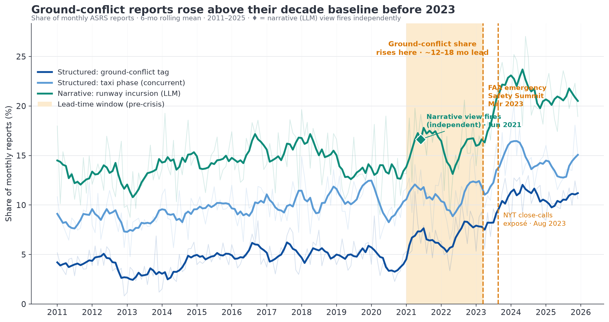
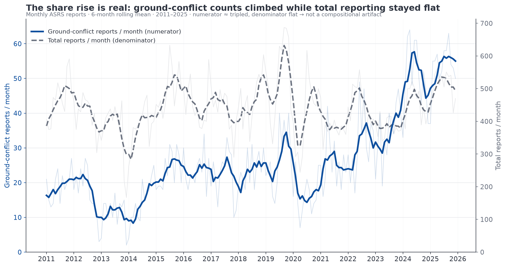
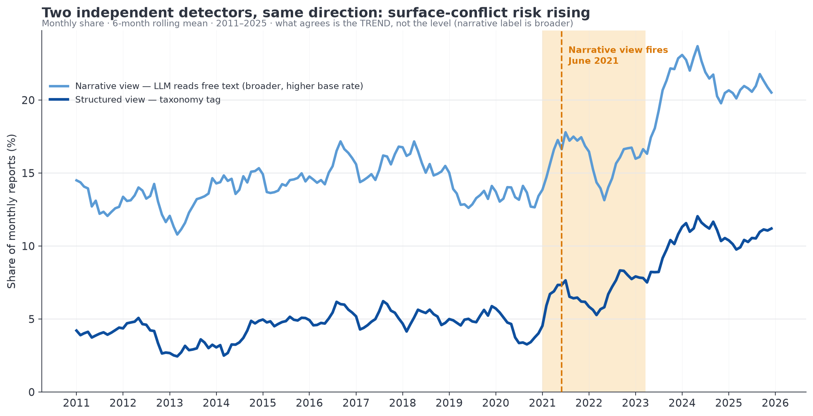
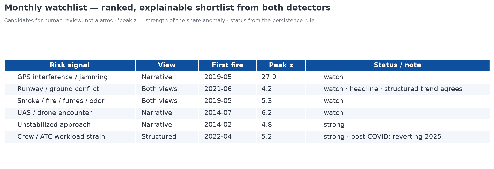

**IATA Senior Data Scientist — technical case study.** Data: NASA Aviation Safety Reporting System (ASRS), 80,047 reports, 2011–2025, US.

---

## Executive summary

Accidents are rare and *lagging*; the near-misses that precede them are common and arrive *first*. This study asks whether publicly available data can surface those precursors **before** a risk is widely recognised — and demonstrates that it can, on a worked example.

Using 15 years of ASRS incident reports, two independent detectors were built on a single principle — track each risk category's **share** of monthly reports (not raw counts) and flag a sustained, statistically anomalous rise. One detector reads the **structured taxonomy codes**; the other is a **zero-shot language model** reading the free-text narratives. Both moved early — one as a rising trend, one as a statistical fire:

> **Surface / runway "ground-conflict" near-misses began rising in 2021–2022 — roughly 12–18 months before the public inflection** (the FAA's March 2023 emergency Safety Summit and the August 2023 *New York Times* close-calls exposé). The structured ground-conflict tag roughly doubled (≈5% → 11% of reports, raw count tripled); the narrative model independently fired on runway incursions in **June 2021**.

The rise survives the obvious challenges: it is in the numerator not the denominator, it persists after normalising for the post-COVID traffic rebound (the incursion *rate* ran ~15% above pre-pandemic and *severity* spiked), and it pre-dates the summit (ruling out awareness-driven over-reporting). External FAA/DOT-OIG figures confirm both the rise and its 2024 easing.

The deliverable is not an accident predictor. It is a **leading indicator** and an **operating model**: the same pipeline produces a ranked monthly watchlist of *what is emerging and where to look first* — a triage queue for human analysts, months earlier than the lagging record would allow.

---

## 1. Problem framing

**How should an "early-warning system" for aviation safety be interpreted?** Not as accident prediction. Accidents are (thankfully) rare, and a model trained on them learns from the lagging record. The tractable, useful problem is **detecting precursors trending upward before the adverse outcome is widely recognised — from data already held.**

This reframing drives every subsequent choice:

- **What to monitor:** *precursors* — voluntary near-miss reports — rather than accidents. ASRS is a national, public repository of exactly these, filed by pilots, controllers, and maintenance personnel, and rich in free-text narrative.
- **What counts as a signal:** a **sustained rise in the share** of reports about a given risk — a change in the *mix* of what is being reported, not merely in how much is reported.
- **What the output is:** a **ranked shortlist for human review**, explicitly framed as *leading indicators, not alarms* — a reason for an analyst to look, never an automated verdict.

This matches how the role's domain actually operates: the value is in *framing, reasoning, and communication* of a credible early signal, not in a black-box predictor.

---

## 2. Data

**Source.** NASA ASRS, 2011–2025: **80,047** reports after de-duplication by accession number (`ACN`), **127** columns, of which **79,572** carry a usable free-text narrative. Combined from 15 annual public extracts.

**Grain and limitations (stated up front, because they bound every claim):**

| Property | Reality | Consequence |
|---|---|---|
| Time | `Date` is **YYYYMM only** (month grain, 100% filled) | Monthly series are the finest temporal resolution; no exact-date or intraday analysis |
| Location | **No airport / origin–destination** (de-identified by design); only facility *type* and US state | No airport-level hotspotting; geography limited to coarse slices |
| Reporting | **Voluntary**; total monthly volume swings (2019 peak, 2020 COVID trough) | Raw counts conflate "how much is reported" with "what happened" → drives the share-based metric (§3) |
| Latency | ~60-day processing lag | The most recent 2–3 months are under-reported and excluded from "fired" claims (shown but greyed) |

**Well-populated signal carriers** include `Anomaly` (99.9%, multi-label taxonomy of what went wrong), `Contributing Factors / Situations`, `Person 1 | Human Factors`, `Aircraft 1 | Flight Phase` (96.7%), and the `Report 1 | Narrative` free text (100%). Multi-label fields are `"; "`-joined and exploded so a report contributes to every category it lists.

A QA-first exploratory pass (`production/build/01-eda.ipynb`) established schema integrity, temporal coverage, missingness, and reporting-bias diagnostics before any modelling.

---

## 3. Method — the operating model

The architecture is deliberately simple and transparent: **one detection engine, fed by two independent labellers.**

### 3.1 One detection engine (shared)

Every label — whether a structured tag or a narrative-derived label — is turned into a monthly series and run through identical logic:

1. **Metric — share, not counts.** `s_c(t) = count_c(t) / total_reports(t)`. A signal is a shift in *share*, which controls for overall reporting propensity (the central ASRS caveat).
2. **Robust anomaly score.** Against a trailing **24-month** baseline, `z = (s_c(t) − median₂₄) / (1.4826 · MAD₂₄)`. Median/MAD (not mean/SD) so the baseline is not inflated by the very spikes being hunted.
3. **Thresholds + persistence.** `|z| ≥ 2` = *watch*, `≥ 3` = *strong*; a fire requires the threshold to hold for **≥ 3 consecutive months** (kills one-off blips). Early-warning focuses on rising shares.
4. **Bias guards (mandatory before a fire counts).**
   - **Taxonomy-change guard** — categories whose first non-zero month is after 2011 may reflect a code being introduced/renamed; they are gated from signal claims.
   - **Seasonality guard** — a fire requires a positive year-over-year share change, so a recurring seasonal bump alone will not trigger.
   - **Multiple-testing stance** — with ~40 categories × ~180 months, outputs are framed as *ranked candidates* (rank = `peak_z × months_sustained`), not alarms.

### 3.2 Two labellers (differ only in how a report is labelled)

- **Structured view** — labels come from the ASRS taxonomy codes (`Anomaly`, `Flight Phase`, …). Precise, but only sees risks that already carry a code.
- **Narrative view** — a **zero-shot LLM** reads the free text and assigns ~10 plain-English risk labels (e.g. *runway incursion / ground conflict*, *GPS interference / jamming*, *unstabilized approach*, *fatigue*). It catches the **emerging and unlabelled** — risks with no taxonomy code at all. A second, **unsupervised** topic-discovery pass (embeddings → clustering) guards against the "only finds what you name" confirmation-bias risk.

The strongest signal is one where **both views agree** — a narrative theme rising in step with a structured category — because they are entirely separate pipelines with different blind spots.

> **Implementation note (honest record).** The narrative labeller was *prototyped* on a local GLiNER2 model (free, CPU). At full coverage that path measured ~66 h on CPU for 80k narratives, so the production run used a hosted zero-shot model — **OpenRouter `deepseek/deepseek-v4-flash`**, concurrent batched calls, across all **79,572** narratives. Only the labelling engine changed; the §3.1 detector logic is identical. (Output files retain a `gliner_label_*` name for historical continuity.) Full reasoning in `production/spec/methodology.md` §6.1 and `research/notes/signalB-scale-cost.md`.

---

## 4. Finding — surface & runway near-misses rose early

The structured detector surfaced **42 candidate series (26 with a persisted fire, 0 gated as taxonomy artifacts)**. The locked headline — chosen because it is falsifiable and externally checkable — is **surface / ground-conflict near-misses**, where a rising *structured trend* and a *persisted narrative fire* coincide.

**The structured `Conflict Ground Conflict` share roughly doubled:**

| Year | 2011 | 2013 | 2021 | 2023 | 2024 | 2025 |
|---|---|---|---|---|---|---|
| Ground-conflict share | 4.1% | 3.0% | 6.7% | 9.0% | **11.2%** | 10.5% |

corroborated by the concurrent `Taxi`-phase rise (~8–11% → 15.2% in 2024). **Independently, the narrative model fired on the `runway incursion / ground conflict / surface movement` label in June 2021** (persisted watch fire). Two methods, different pipelines, same trend and timing.

**The most instructive detail:** the structured share **spiked above the alarm threshold repeatedly** — its robust *z* reached ≈6, including in April 2021 — but **never for three consecutive months** (its longest watch run was 2), so the persistence rule never let it register a *fire*. The noisier structured series kept tripping and resetting; the **narrative** label rose smoothly enough to hold the 3-month rule and produced the **only sustained fire — June 2021**. Two detectors, two different failure modes — the argument for running both, not a weakness to hide.

### 4.1 It led the publicly-recognised crisis by ~12–18 months

| When | What | Source |
|---|---|---|
| **Jun 2021** | Narrative detector fires on runway incursions | this analysis |
| 2021–2022 | Structured ground-conflict share inflects upward | this analysis |
| Jan / Feb 2023 | JFK (AA777 runway crossing) and Austin (SWA/FedEx ~150 ft) near-collisions | NTSB / press |
| **Mar 2023** | FAA convenes emergency Aviation Safety Summit | FAA newsroom |
| Aug 2023 | NYT: "Airline Close Calls Happen Far More Often Than Previously Known" | NYT |

The ASRS-derived signal **led the widely-recognised crisis by roughly 12–18 months.** Notably, the FAA's own response was to *mine its ASIAS safety database for emerging trends* — **reactively, after** the events. The same idea, applied **proactively**, is exactly what this method demonstrates.

---

## 5. Robustness — ruling out the artifacts a reviewer will probe

### 5.1 Is the rising *share* just a denominator / compositional artifact?

No. Checked directly against the count series:

| Year | Ground-conflict count (numerator) | Total reports (denominator) | Share |
|---|---|---|---|
| 2011 | 230 | 5,646 | 4.1% |
| 2021 | 305 | 4,571 | 6.7% |
| 2023 | 411 | 4,589 | 9.0% |
| 2024 | 606 | 5,427 | 11.2% |
| 2025 | 642 | 6,109 | 10.5% |

The **numerator roughly tripled** while the **denominator stayed in a flat ~4,500–6,100/yr band**. Because `Anomaly` is **multi-label**, category shares do not sum to 100% — one category rising does not mechanically force another down, so the naive pie-slice artifact does not apply. External absolute counts rose independently.

### 5.2 Isn't it just the post-COVID traffic rebound?

The single biggest challenge — *more flying ⇒ more conflicts, mechanically* — is ruled out on two counts:

- **The rate rose.** FY2023 had **fewer operations than FY2019 (37.3M vs ~43M) yet more incursions** (~1,777, ~5/day) → incursions-per-operation ran **~15% above** the pre-pandemic baseline.
- **Severity, not just frequency, spiked.** Category A&B ("serious", collision narrowly avoided) incursions hit **22 in FY2023 — a six-year high — then fell to 9 in FY2024 (−59%)**. More traffic raises frequency, not severity; this mirrors the share peaking ~2024 and easing in 2025.

### 5.3 Other guards

- **Reverse causality** (post-summit awareness → more reporting): the signal **pre-dates** the March 2023 summit, so awareness-driven over-reporting cannot explain the leading edge — it strengthens the claim.
- **Taxonomy artifact:** `Conflict Ground Conflict` exists from 2011 (`taxonomy_suspect = False`).
- **Seasonality:** fires require positive YoY change.
- **Units caveat:** external counts are fiscal-year, raw; the figures here are calendar-month share — directionally consistent, *not* like-for-like (stated explicitly).

### 5.4 Does the z-threshold assume normality? (distributional check)

The robust *z* carries a normal-theory reading (z ≥ 2 ≈ a 1-in-20 deviation), so the share distribution was checked directly (`make_normality_diagnostic.py`). It is **not** normal: the ground-conflict share is right-skewed (Shapiro–Wilk p ≈ 3×10⁻⁸), and the pooled robust-*z* across all 42 candidate categories is fat-tailed (excess kurtosis +5.1) — empirically `|z| ≥ 3` occurs in **4.2%** of category-months versus the **0.27%** normality would imply (~15×). This does **not** undermine the method: median and MAD assume no distribution, so the detector stays valid. The consequence is interpretive — the 2/3 cut-offs are used as an **empirical screening rank, not calibrated p-values** (no significance level is ever claimed) — and the fat tails are precisely *why* the **persistence rule**, not a p-value, is the real false-positive control: a single extreme month is common, so a signal must hold for three.

---

## 6. Validation — was the language model checked?

The narrative LLM is the novel half of the method and carries the formal June-2021 fire, so its output was spot-checked. **30 narratives the model flagged** with the runway label were independently adjudicated (positives only → precision, not recall; confidence-stratified, seeded for reproducibility — `production/build/validate_narrative_labels.py`):

| Metric | Value |
|---|---|
| Precision — broad (genuinely surface/ground-related) | **70%** (21/30) |
| Precision — strict (true incursion/conflict near-miss) | **37%** (11/30) |
| Precision by confidence ≥0.95 / 0.90 / ≤0.85 | **88% (7/8) / 70% (7/10) / 58% (7/12)** |

The confidence bands are small (n = 8 / 10 / 12), so read the gradient as directional rather than precise — the takeaway is simply that model confidence is informative.

**Dominant failure mode:** 8 of 9 false positives are *airborne* near-mid-air collisions the model tags as "conflict" — the word "conflict" in the label bleeds airborne events into a surface label. A confidence threshold (~0.95) or an airborne-vs-surface guard would sharpen it materially.

**Why the headline still holds:** the label is broad (it flags ~15.7% of narratives; base rate ~13% even in 2011), so its *absolute level* is overstated. The early-warning claim therefore rests on the **trend** (the rise and the June-2021 fire) and on **agreement with the cleaner structured tag** — which does not share this failure mode — *not* on the narrative level. A 70%-broad / 37%-strict precision is acceptable for a triage shortlist; it would not be acceptable for an automated count, which is precisely why the output is framed as a candidate for review.

---

## 7. From one signal to a monthly watchlist (decision-support)

This worked example is a **proof of concept**. The same pipeline already emits a **ranked monthly watchlist** from both detectors — a short, explainable list of what is emerging and where to look first.

**Value to a safety team:** instead of waiting for the lagging accident/incident record, an analyst gets a prioritised, *explainable* queue of rising precursors — each traceable to the reports behind it — months earlier. It supports decisions about **where to focus limited inspection, audit, and outreach attention**.

**How it would slot into practice:**
- **Monthly run** on the latest ASRS extract; the freshest 2 months flagged soft (reporting lag).
- **Human-in-the-loop triage** — candidates, not alarms; an analyst confirms or dismisses, building a feedback record.
- **Cross-source corroboration** for anything that fires, exactly as done here.

---

## 8. Limitations — what this is, and what it isn't

**What it is:** a leading indicator that risk is *rising*; low-cost, public, explainable, reproducible; corroborated three ways (narrative fire + structured trend + external sources).

**What it isn't:**
- **Not accident prediction** — these are precursors, not accidents.
- **Not causal.** The leading hypothesis is post-COVID understaffing plus the traffic rebound — but only the *symptom* is observed, not the cause.
- **Not bias-free.** Voluntary-reporting bias is *mitigated* (share, not counts) — not eliminated.
- **Coarse.** Monthly, US-only, de-identified (no airport). These figures and the FAA's agree in *direction, not magnitude*.

---

## 9. Reproducibility

| Component | Location |
|---|---|
| EDA / QA | `production/build/01-eda.ipynb` |
| Signal A (structured) | `production/build/02-structured-signals.ipynb` |
| Signal B (narrative LLM + discovery) | `production/build/03-narrative-signals.ipynb` |
| Method spec (single source of truth) | `production/spec/methodology.md` |
| External corroboration & bias rule-outs | `research/notes/phase5-corroboration.md` |
| Narrative validation | `research/notes/narrative-validation.md` |
| Distributional / normality diagnostic | `production/build/make_normality_diagnostic.py` → `output/eda/normality_diagnostic.png` |
| Figures & chart builders | `production/output/`, `production/build/make_*.py` |
| Presentation | `writing/deck.pdf` |

- **Data** is not committed (NASA ASRS public extracts); see the README for the documented download steps.
- **Environment:** Python 3.12, `requirements.txt` (Polars, pandas, scikit-learn, matplotlib, httpx).
- **Narrative model:** OpenRouter `deepseek/deepseek-v4-flash` (needs `OPENROUTER_API_KEY`); the derived label parquets are committed so Signal B is inspectable without re-running the paid step.

---

## Sources

- NASA ASRS Database Online — asrs.arc.nasa.gov
- DOT OIG, "FAA Has Taken Steps To Prevent and Mitigate Runway Incursions" (final report, Mar 2025) — oig.dot.gov
- FAA, "Readout from the FAA Aviation Safety Summit" (Mar 2023); FAA *Air Traffic by the Numbers* (2024); FAA Runway Safety Statistics
- NYT, "Airline Close Calls Happen Far More Often Than Previously Known" (Aug 21, 2023)
- Honeywell Aerospace (serious incursions 16→23, 2022→2023)

---

Authorship & provenance: this analysis was produced with AI-agent assistance under human direction; every material contribution is logged in `provenance-ledger.md` with author, timestamp, and change. The transparency is deliberate — the method, the self-corrections (e.g. the structured z-detector staying silent), and the model pivot are all part of the record.
